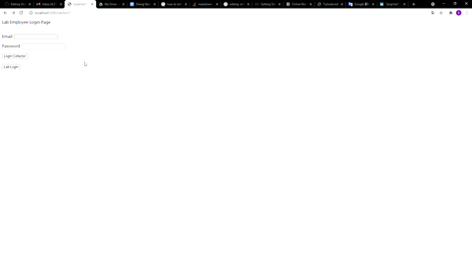
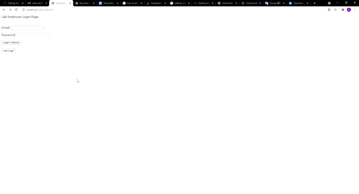
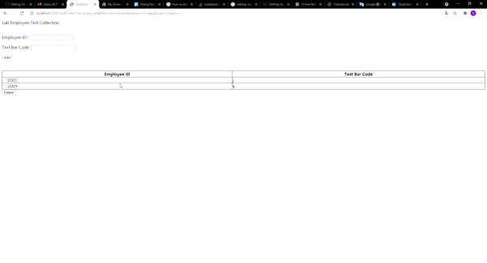

# 
 **Virus Testing Site** 

## **Description**

 Virus Testing Site is a small local web application allowing users to login as employee and check their virus test result, or users can login as lab employer to create test pool and assign result to each pool. 

## **How To Use**

**Employee Login To Test Result Page**

 

    *Tip: *

**Lab Employer Login Collector **

 

    *Tip: *

**Lab Employer Login Test Creation**

 

**Adding Test Bar Code**

 

**Pool Mapping**

 

    *Tip: Avoid traps*

**Well Testing**

 

    *Tip: Find another path other than going straight up*

## **Built With**
* JavaScript
* HTML
* CSS
* Node.js
* Express.js
* MySQL

## **Contributors**
### Github:
* Sheng Da Chen: https://github.com/asd908433289
* Jin Quan Chen: https://github.com/asd908433289

### LinkedIn:
* Sheng Da Chen: https://www.linkedin.com/in/sheng-chen-684014202/
* Jin Quan Chen: https://www.linkedin.com/in/jinquan-chen-846b141ab/

